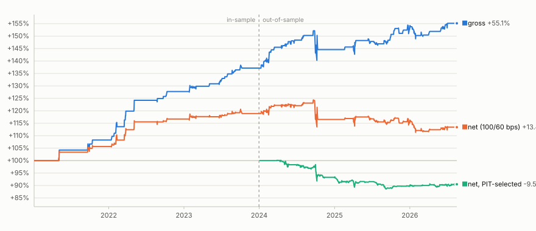

# China A/H Arbitrage

*Mean-reversion pair trade on Hong Kong / mainland dual-listed Chinese equities: Kalman hedge ratio, 60-day rolling z-score, cost-aware backtest with an in-sample / out-of-sample split.*

---

## Overview

A/H twins are the same company listed on both Shanghai/Shenzhen (the "A" share, CNY) and Hong Kong (the "H" share, HKD). Frictions between the two markets - capital controls, mainland retail participation, quota limits on Stock Connect keep the two prices from tracking mechanically, so the A/H premium mean-reverts around a slowly-drifting equilibrium. We select tradeable pairs from the scraped Hang Seng A/H list, fit a time-varying hedge ratio with a Kalman filter, and trade a rolling z-score of the residual spread with realistic per-leg costs.

The **in-sample** book (2 pairs, 2021-01 → 2023-12) runs at gross Sharpe 2.12 / net Sharpe 1.22 after 100/60 bps round-trip costs. The **out-of-sample** book (2024-01 → 2026-08) runs at gross Sharpe 0.64 / **net Sharpe −0.20** and re-selecting the universe using only information available at end-2023 delivers **net Sharpe −0.82** OOS on a different (larger) set of pairs. The gap between the IS and OOS numbers is the tell: the selection filter is computed on the full sample, so the IS Sharpe is largely a retrospective pair-picking artifact rather than a captured edge. The gross signal is directionally alive (Sharpe positive across every cut); costs and honest selection eat it.

## The hypothesis

The A/H premium (`p_A − FX·p_H`) is a stationary process around a slowly-varying equilibrium, driven by segmentation between the mainland and offshore markets rather than by any fundamental disagreement about the underlying business. On liquid pairs with a short-enough half-life, entering at 2σ and exiting at 0.5σ captures the reversion; a 3.5σ hard stop takes the pair off risk when the "equilibrium" itself is regime-shifting.

## Method

- **Hedge ratio**: Kalman filter with a random-walk state (`δ = 1e-5`) on `A ~ β·H`. Filtered means (causal), not smoothed. `kalman.py`.
- **Signal**: `spread = A − β·H_CNY`; z-score on a 60-day rolling window; entry at |z|>2, exit at |z|<0.5, hard stop at |z|>3.5. `signals.py`, `research/engine.py`.
- **Position sizing**: one unit position holds A against β·H (in CNY) and is scaled so |wA|+|wH|=1, i.e. the capital base is gross notional and there is no implicit leverage. Weights lag the signal by one day. `research/engine.py`.
- **Book**: equal capital across surviving pairs; a pair only draws capital once it has data (no forward-filling into inception).
- **Costs**: round-trip bps per leg, applied as half on each weight change. Base case is 100 bps on the A-share leg (mainland stamp duty + commission + slippage) and 60 bps on the H-share leg. Full grid in the Results section.

## Bias controls

The stuff that actually matters, in the order it can bite:

- **FX consistency in the spread**: the H leg is converted to CNY at the same-day USDCNY/USDHKD cross before the spread is formed. Trading a raw A − β·H (mixed currency) makes β absorb the FX drift and gives you a phantom cointegration.
- **Point-in-time signal**: the Kalman β is filtered (uses only data up to *t*), not smoothed (which would use future data). The rolling z-score is causal by construction (`.rolling(60)`). Signals lag prices by one day into weights.
- **Selection bias is measured, not assumed**: the ≤20-day half-life filter is computed on the full sample (`research/engine.py::selection_stats(..., end=None)`), which inflates the in-sample backtest. The pipeline *also* runs the same filter using only data available at 2023-12-31 (`selection_stats(..., end=IS_END)`) and trades those survivors forward. Comparing the two books is the honest quantification of the selection artifact.
- **Survivorship**: the pair universe (`data/ah_pairs.csv`) is scraped as-of-today, so delisted or de-dual-listed pairs are missing. Every survivor's history is post-listing-only. This is not fixed in this repo; it is stated and quantified where it matters (see Caveats).
- **Cointegration is reported, not applied**: the Engle-Granger test is run on all 84 liquid pairs (`research/run_report.py::engle_granger`) but not used as a filter, because the ≤20d half-life gate above it is already more selective. Both traded pairs pass EG anyway (Haier p ≈ 2×10⁻⁵, CTG p ≈ 1×10⁻⁸).
- **Cost realism**: costs are quoted per leg, not per pair, and applied to each weight change (turnover-driven), not a fixed per-trade fee. A-leg round trip is deliberately higher than H (stamp duty is asymmetric and mainland liquidity is thinner for a Western book).

## Repository layout

```
research/
├── build_cache.py          # one-time Yahoo pull, ~5 min -> data/cache/*.parquet
├── engine.py               # funnel, Kalman signal, gross-notional book, PIT selection
├── run_report.py           # end-to-end pipeline -> results/*.csv + summary.json
└── plot_equity.py          # equity_curve.svg with dark-mode swap

data/
├── ah_pairs.csv            # scraped A/H universe (150 pairs, as-of-today)
├── ah_pairs_arb.csv        # notebook intermediates
├── ah_pairs_arb2.csv       #  "
└── cache/                  # parquet cache of prices / volume / FX

results/                    # regenerated end-to-end by run_report.py
├── README.md               # results write-up (full detail)
├── equity_curve.svg
├── headline.csv            # gross/net Sharpe, DD, tot ret by window
├── per_pair.csv
├── cost_sensitivity.csv    # Sharpe at each cost grid point
├── pit_book_oos.csv        # PIT-selected book, OOS window only
├── selection_stats_full_sample.csv
├── selection_stats_pit_2023.csv
├── engle_granger_liquid_set.csv
├── book_daily.csv
├── pit_book_daily.csv
└── summary.json

kalman.py, prices.py, signals.py               # original helpers used by the notebooks
China AH Universe Selection.ipynb              # scraped-universe filter walkthrough
China Arbitrage.ipynb                          # single-pair backtest walkthrough (superseded by research/)
```

## Installation

```bash
git clone https://github.com/AditiJoshi12/China-AH-Arbitrage.git
cd China-AH-Arbitrage
pip install -r requirements.txt   # yfinance, pandas, numpy, statsmodels, pykalman, vectorbt
```

## Usage

```bash
python research/build_cache.py       # one-off Yahoo download for all 300 tickers + FX
python research/run_report.py        # funnel, backtest, cost grid, PIT counterfactual
python research/plot_equity.py       # equity_curve.svg
```

The two notebooks (`China AH Universe Selection.ipynb`, `China Arbitrage.ipynb`) walk through the same logic pair-by-pair and are kept for reference; the `research/` scripts are the current end-to-end path.

## Results

Full write-up with commentary in **[results/README.md](results/README.md)**. Headline numbers from the walk-forward run:

### Universe funnel

150 scraped pairs → 2 traded. Filter counts (all computed on the full sample; see caveat 1):

| stage | pairs remaining |
|---|---:|
| scraped A/H pair list | 150 |
| both legs have price history since 2019 | 150 |
| ADV > CNY / HKD 5×10⁷ on both legs | 86 |
| premium half-life < 20 days | 2 |
| ≥ 500 overlapping observations (final) | **2** |

Survivors: **HAIER SMARTHOME** and **CTG DUTY-FREE**.

### Headline (100/60 bps round-trip per leg)

| window | days | gross Sharpe | **net Sharpe** | max DD | total return | ann. turnover (× gross) |
|---|---:|---:|---:|---:|---:|---:|
| Full (2021-01 → 2026-08) | 1,422 | 1.24 | 0.39 | −10.5% | +13.4% | 13.9 |
| **In-sample** (2021-01 → 2023-12) | 759 | 2.12 | **1.22** | −1.9% | +18.9% | 11.9 |
| **Out-of-sample** (2024-01 → 2026-08) | 663 | 0.64 | **−0.20** | −10.5% | −4.6% | 16.2 |

**The OOS number is the one that matters.** Per pair, Haier is the only name that survives costs on any horizon (IS net 1.23, OOS net 0.27); CTG runs net-negative from inception.

### Cost sensitivity

Sharpe at each cost level, in round-trip bps per leg (A / H):

| A | H | full | in-sample | **out-of-sample** |
|---:|---:|---:|---:|---:|
| 0 | 0 | 1.24 | 2.12 | **0.64** |
| 25 | 15 | 1.03 | 1.91 | **0.43** |
| 50 | 30 | 0.82 | 1.69 | **0.23** |
| **100** | **60** | **0.39** | **1.22** | **−0.20** |
| 150 | 90 | −0.06 | 0.72 | **−0.62** |
| 200 | 120 | −0.50 | 0.23 | **−1.05** |

Breakeven A-leg round-trip cost (H held at 0.6× A): **~144 bps full sample, ~223 bps in-sample, ~77 bps out-of-sample**. The OOS breakeven sits below the base cost assumption; turnover ~14× gross a year means every extra 10 bps of round-trip cost shifts net Sharpe by roughly 0.2 to 0.3 units.

### Equity curve



Three lines, one y-axis: **gross** (blue), **net at 100/60 bps** (orange), **net PIT-selected** (green, the honest counterfactual, universe re-selected using only data available at 2023-12-31 and traded OOS).

## Caveats

Two things a reader should know before mapping these numbers onto any decision:

**1. The ≤20-day half-life filter is computed on the full sample (2019-01 → today), not rolling, and this inflates the in-sample backtest.** A pair only enters the book because we *already know* its premium was mean-reverting over a window that includes the trading period. This is textbook selection bias. To quantify it rather than just note it, `run_report.py` also runs the same filter using only data available at 2023-12-31 (`results/selection_stats_pit_2023.csv`) and trades the six survivors forward: 6 pairs pass PIT vs 2 pass full-sample, and they are **almost entirely different names** (only Haier overlaps). That PIT-selected book returns **net Sharpe −0.82 / max DD −11.5% over the OOS window**, versus the full-sample-selected book's net Sharpe −0.20 over the same period. The gap is the selection bias, made concrete: the in-sample edge is largely retrospective pair-picking, not signal.

**2. The pair universe was scraped as-of-today, so delisted, acquired, or de-dual-listed pairs are missing (survivorship bias) and every survivor's history is post-listing-only.** The 150 names in `data/ah_pairs.csv` are today's Hang Seng A/H twins; anything that stopped trading in either market before the scrape date isn't in the file. That biases upward in the usual way (surviving pairs are the ones whose businesses held together over the sample), and it also means selection filters like ADV and half-life run on backfilled histories that a real trader wouldn't have seen day-one. Fixing this properly needs a historical A/H membership snapshot with delisted tickers preserved (SEHK/CSMAR historical constituents); the current pipeline only mitigates by measuring the PIT counterfactual above.

Both caveats push the same way: **the honest number to quote is the PIT-selected OOS Sharpe of −0.82**, not the 1.22 in-sample or the 0.39 full-sample. The pair-trade construction works (gross Sharpe is positive across every cut), but on this universe and cost regime it doesn't survive to net alpha.

## Roadmap

- [ ] Historical A/H membership snapshot with delisted tickers preserved (fixes survivorship at the source)
- [ ] Rolling half-life / ADV filter instead of full-sample (removes the selection bias in the in-sample number)
- [ ] Stock-Connect quota-utilisation and Southbound/Northbound flow features
- [x] Point-in-time selection counterfactual + PIT-selected OOS book, quantifies the selection artifact
- [x] Cost sensitivity grid + per-leg breakeven

## License

MIT © 2026 Aditi Joshi
